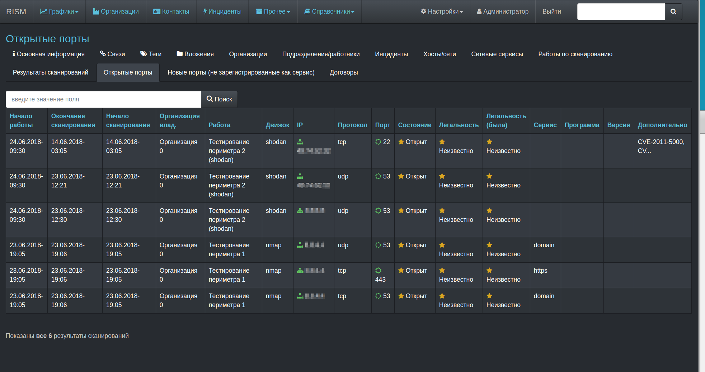
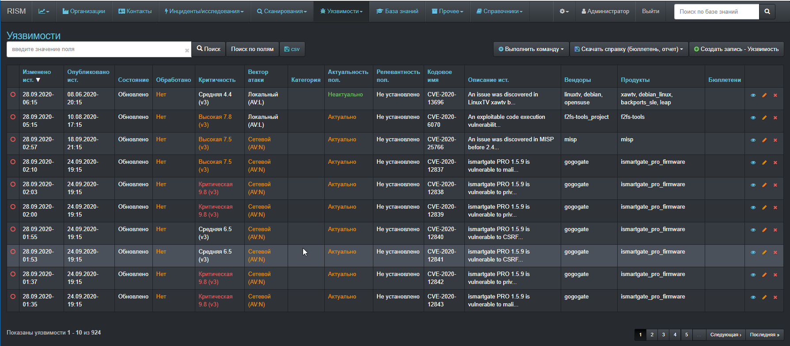
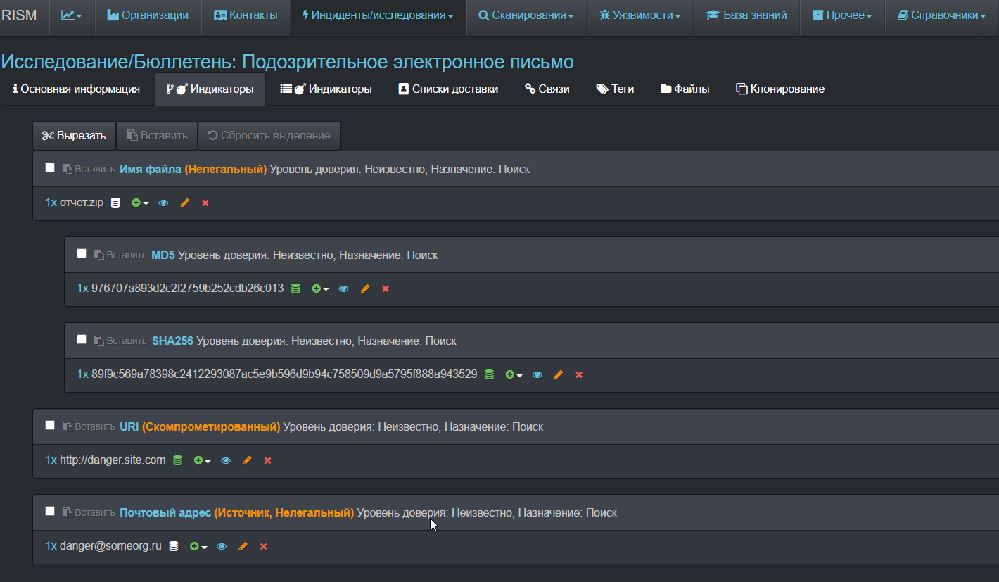
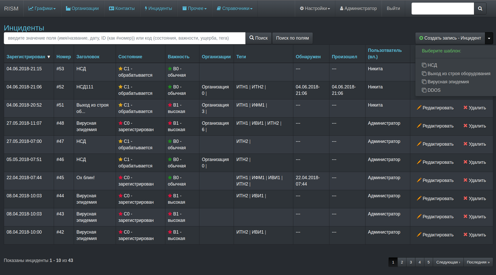
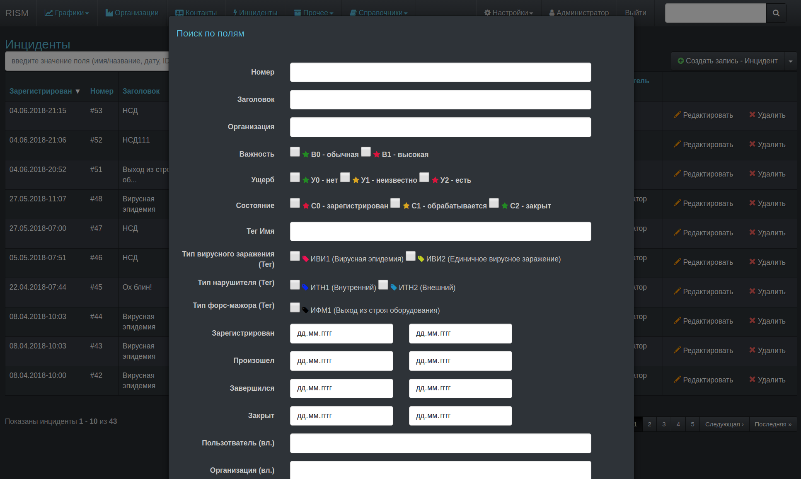
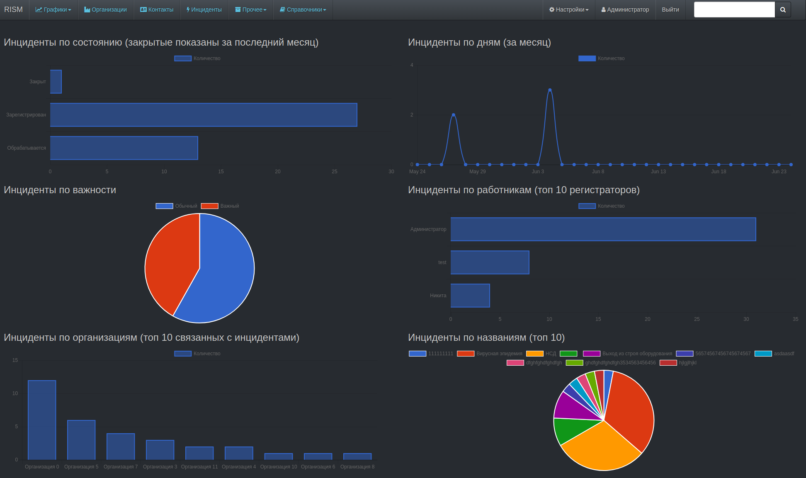
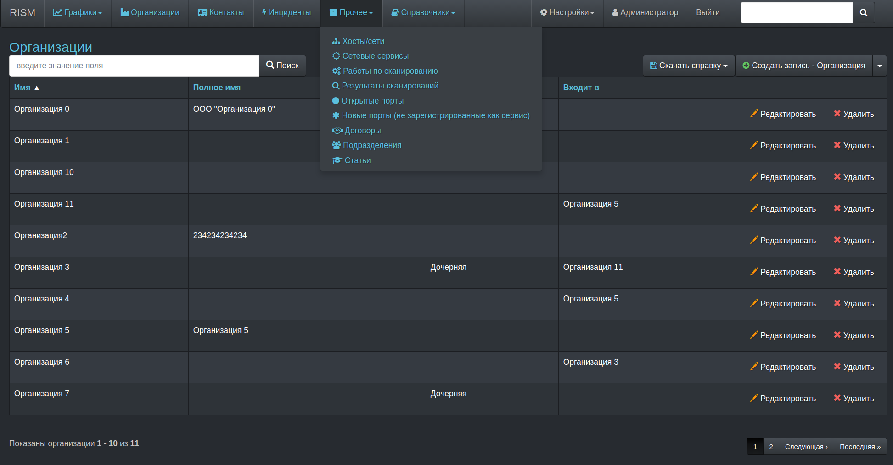
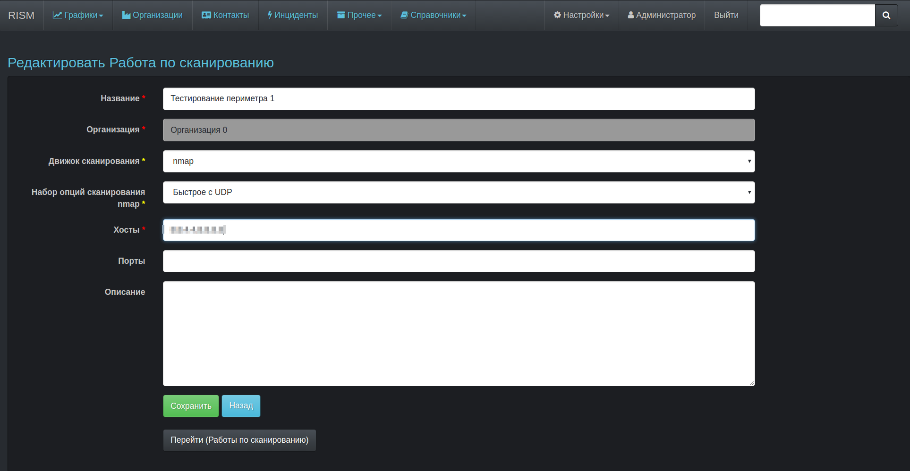

# ZEPSEC
"And I looked, and behold a pale horse: and his name that sat on him was Death, and Hell followed with him. And power was given unto them over the fourth part of the earth, to kill with sword, and with hunger, and with death, and with the beasts of the earth." 

Revelation 6:2-8

## Introduction 
ZEPSEC is an enterprise-grade SaaS solution designed to streamline information security management processes. Our platform serves as a centralized hub for vulnerability management, threat intelligence, and security operations. We build it ontop of a Russian hacker tool purchased on the DarkWeb and improved it with AI-assisted log analysis and reporting, and of course an English language conversion of the interface. And threat monitoring integrations with X-Force and Shodan. And removal of all the hidden backdoors we found in the original. Proactively monitor and address your networks' weakest links before the bad guys find them first.

## Features

- **Organization Management**: Efficiently manage and organize your security infrastructure.
- **User Management**: Comprehensive contact and user administration.
- **Incident Tracking**: Robust system for documenting and managing security incidents.
- **IoC Handling**: 
  - Manual addition during incident response
  - Automated enrichment of indicators
- **Security Scanning**: 
  - Port scanning from ZEPSEC servers
  - Remote agent (RA) support for distributed environments
- **Vulnerability Management**: 
  - Automated import from the National Vulnerability Database (NVD)
  - Custom attribute enrichment for tailored risk assessment
- **Agreement Tracking**: Manage and monitor security-related agreements and contracts.
- **Knowledge Base**: Centralized repository for security information and best practices.
- **Automated Alerting**: Email notifications for new IoCs, vulnerabilities, and knowledge base articles.
- **REST API Integration**: Seamlessly transfer IoC data to other security tools in your ecosystem.

### Planned Features

- Asset Management (CMDB)
- Advanced Incident Workflow
- Task Management System
- Audit Logging and Reporting
- Risk Assessment and Management
- Additional features based on user feedback and industry trends

### Current Status

While ZEPSEC is in active development, the current open-source version is in Russian (our English version is proprietary, teeheehaha...) and stable and suitable for production use by experienced security professionals. We continuously update and improve our platform based on user feedback and emerging security needs.

### Screenshots

For more information, feature requests, or to report issues, please contact our support team or visit our website.

*ZEPSEC - Empowering Your Security Operations*
